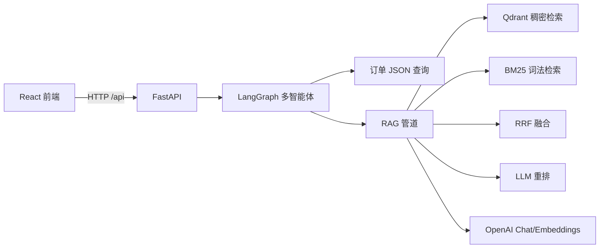

# 架构说明（Mall Agent）

## 总览

## 后端模块

| 路径 | 职责 |
|------|------|
| `app/main.py` | FastAPI 路由：`/api/chat`、`/api/orders`、`/api/orders/export`、`/api/admin/reingest` |
| `app/bootstrap.py` | 启动时确保 Mock 订单、KB PDF、（可选）向量入库 |
| `app/config.py` | 环境变量读取为 `dataclass Settings` |
| `app/graph/workflow.py` | LangGraph：`router` → `orders` / `rag` → `answer` |
| `app/rag/pipeline.py` | PDF→清洗→分块→Embedding→Qdrant；混合检索+重排 |
| `app/rag/text_clean.py` | 文本规范化 + 分块模板前缀 `[KB片段]` |
| `app/services/orders.py` | 本地 JSON 订单过滤与 CSV 导出 |
| `app/mocks/*` | Mock 订单与 PDF 种子数据 |

## RAG 细节

1. **PDF**：`pypdf` 抽取文本。  
2. **清洗**：Unicode 正规化、控制字符剔除、空白折叠（`text_clean.py`）。  
3. **
4. **向量库**：`text-embedding-3-small`（默认）写分块**：滑动窗口 + 每块前缀模板，增强向量语义锚点。  入 Qdrant；每次全量 `reingest` 会删集合再建，便于演示一致性。  
5. **混合检索**：Qdrant 向量 TopK + 本地 BM25 TopK，**RRF** 融合候选，再用 **gpt-4o-mini** 仅输出 JSON 数组完成重排。  
6. **无密钥模式**：未配置 `OPENAI_API_KEY` 时跳过入库；聊天路由仍可走订单分支。

## 多智能体（LangGraph）

- `router`：让模型输出 `ROUTE=orders|kb|both|general` 单行标记。  
- `orders`：从自然语言抽取简单槽位（状态、渠道、金额阈值、订单号）并查询 JSON。  
- `rag`：调用混合检索，拼接摘录。  
- `answer`：系统提示约束“不要编造订单”，综合上下文生成中文答复。

## 前端

- Vite + React。  
- 生产镜像：`node build` + `nginx` 反代 `/api` → `backend:8000`。  
- 开发模式通过 `vite.config.js` 代理 `/api`。

## 数据目录

默认 `DATA_DIR=data`（相对后端根目录）。Docker 通过命名卷挂载到 `/app/data` 以持久化订单与 `chunk_store.json`。
