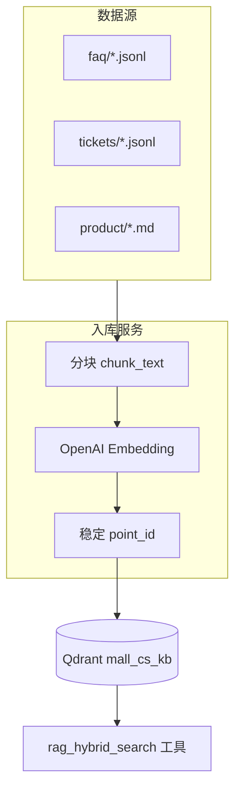

# 知识库入库与向量库更新指南

本文说明如何将 **支付 FAQ**、**历史工单**、**产品文档** 等资料写入 Qdrant，以及在 **文档变更后如何更新向量**，供支付咨询 Agent 的混合检索（稠密向量 + BM25）使用。

---

## 1. 架构简述



| 组件 | 作用 |
|------|------|
| `backend/data/kb/` | 原始知识文件目录（可挂载、可 CI 同步） |
| `app/services/kb_ingest.py` | 解析、分块、删旧点、写入 Qdrant |
| `app/cli/ingest_kb.py` | 运维命令行：全量 / 单文件 / 单文档更新 |
| `app/db/qdrant.py` | 集合创建；**空库**时自动尝试从 `data/kb` 导入 |
| `app/tools/rag_tool.py` | 检索时：向量检索 + 基于 Qdrant scroll 的 BM25 |

**说明：** BM25 索引在每次检索时从 Qdrant 中的 `text` 载荷临时构建，**无需单独维护 BM25 文件**。更新 Qdrant 中的点后，下一次检索即生效。

---

## 2. 目录与文件规范

默认根目录：

```text
backend/data/kb/
├── faq/
│   └── payment_faq.jsonl      # 支付 FAQ
├── tickets/
│   └── sample_tickets.jsonl   # 历史工单（问答对）
└── product/
    └── refund_policy.md       # 产品/政策 Markdown
```

也支持 `.txt`。Docker 部署时将 `DATA_DIR` 设为 `/app/data`，对应 `/app/data/kb/`。

### 2.1 FAQ（JSONL）

每行一条 JSON，**必填**字段：

| 字段 | 说明 |
|------|------|
| `doc_id` | 稳定业务 ID，更新文档时保持不变（如 `faq-refund-001`） |
| `source` | 固定为 `payment_faq`（写入 payload，便于过滤） |
| `text` | 正文（可含多句说明） |

**推荐可选字段**（进入 metadata / payload）：

| 字段 | 说明 |
|------|------|
| `topic` | 主题：`refund`、`cross_border`、`duplicate_charge` 等 |
| `title` | 标题 |
| `version` | 文档版本或生效日期 `2026-05-01` |

示例：

```json
{"doc_id": "faq-refund-001", "source": "payment_faq", "topic": "refund", "title": "退款到账时间", "version": "2026-05-01", "text": "退款一般 3-7 个工作日原路退回……"}
```

### 2.2 历史工单（JSONL）

格式与 FAQ 相同，建议：

| 字段 | 说明 |
|------|------|
| `source` | `historical_ticket` |
| `doc_id` | 工单号或 `ticket-YYYYMMDD-序号` |
| `text` | 建议包含「用户问题 / 客服处理」结构，便于模型归纳 |
| `order_id` | 可选，订单号 |
| `topic` | 可选，归类 |

示例见 `backend/data/kb/tickets/sample_tickets.jsonl`。

### 2.3 产品文档（Markdown / 文本）

- 每个 `.md` / `.txt` 文件视为 **一篇** 逻辑文档；
- `doc_id` 默认为 **文件名（不含扩展名）**，如 `refund_policy`；
- `source` 默认为 `product_doc`，可在后续扩展为按目录映射。

长文档会自动 **分块**（默认 480 字、重叠 80 字），与 RAG 检索的 chunk 长度策略一致。

---

## 3. 分块与向量 ID（更新策略的基础）

### 3.1 分块

- 函数：`chunk_text()`（`app/services/kb_ingest.py`）
- 默认：`chunk_size=480`，`overlap=80`（与 `RAG_CHUNK_MAX_CHARS` 同量级）
- 超长 FAQ 一条也可能被切成多个 point，检索更精准

### 3.2 稳定 point_id

每个块 ID 由 **`source + doc_id + chunk_index`** 确定性生成（UUID v5）：

```text
point_id = uuid5(NAMESPACE, "{source}:{doc_id}:{chunk_index}")
```

**作用：** 同一文档再次入库时，相同块索引会 **覆盖（upsert）** 原向量与 payload，无需手工删点。

### 3.3 payload 字段

写入 Qdrant 的 payload 至少包含：

| 字段 | 说明 |
|------|------|
| `text` | 块正文（检索展示） |
| `doc_id` | 逻辑文档 ID |
| `source` | `payment_faq` / `historical_ticket` / `product_doc` |
| 其它 | `topic`、`title`、`version`、`order_id` 等 |

---

## 4. 首次入库（全量）

### 4.1 前置条件

1. Qdrant 已启动（本地 `http://127.0.0.1:6333` 或 Docker `qdrant` 服务）
2. `.env` 中配置有效的 `OPENAI_API_KEY`（及 `OPENAI_API_BASE` 中转）
3. 可选：`QDRANT_COLLECTION=mall_cs_kb`

### 4.2 命令

在 **`backend`** 目录执行：

```powershell
cd backend
uv sync
# 导入默认 data/kb 下所有 .jsonl / .md / .txt
uv run python -m app.cli.ingest_kb

# 或指定目录 / 单文件
uv run python -m app.cli.ingest_kb --dir data/kb
uv run python -m app.cli.ingest_kb --path data/kb/faq/payment_faq.jsonl
```

也可使用入口脚本（若已 `uv sync` 注册）：

```powershell
uv run mall-ingest-kb
```

### 4.3 全量重建（清空后重导）

适用于：大规模换库、修改 embedding 模型、payload 结构不兼容。

```powershell
uv run python -m app.cli.ingest_kb --recreate
```

`--recreate` 会 **删除整个 collection**，再导入 `data/kb`（请先确认目录内文件完整）。

### 4.4 应用启动时自动导入

若 collection **不存在或为空**，且配置了 `OPENAI_API_KEY`，`app/main.py` 启动时会：

1. 若存在 `data/kb` 且含可识别文件 → 自动 `ingest_directory`
2. 否则 → 写入内置 4 条 demo FAQ

---

## 5. 文档更新后如何更新向量

按变更范围选择策略：

| 场景 | 推荐做法 | 命令 / 行为 |
|------|----------|-------------|
| **单条 FAQ/工单文案修改** | 按 `doc_id` 覆盖 | 见 §5.1 |
| **整文件替换**（如整份 jsonl） | 对该文件执行 ingest（默认先删同 `doc_id` 再写入） | 见 §5.2 |
| **新增多篇文档** | 放入 `data/kb` 后 ingest 目录或单文件 | §4.2 |
| **删除某篇文档** | 按 `doc_id` 删除 Qdrant 点 | 见 §5.3 |
| **换 embedding 模型 / 重建索引** | 全量 `--recreate` 后重导 | §4.3 |
| **文档变短、块数量减少** | 必须先删该 `doc_id` 再入库（否则会留下旧块） | §5.1（`replace=True` 默认开启） |

### 5.1 更新单篇文档（推荐）

**原理：** `delete_document_points(doc_id)` 删除该文档所有块 → 对新正文分块 → `upsert` 新块。

准备新正文文件 `new_refund.txt`，然后：

```powershell
uv run python -m app.cli.ingest_kb `
  --reindex-doc faq-refund-001 `
  --source payment_faq `
  --text-file new_refund.txt `
  --version 2026-05-16
```

或在 Python 中：

```python
from app.services.kb_ingest import reindex_document
await reindex_document(
    "faq-refund-001",
    "payment_faq",
    "新的退款说明全文……",
    topic="refund",
    version="2026-05-16",
)
```

### 5.2 更新整个 JSONL 文件

将修改后的 `payment_faq.jsonl` 保存后：

```powershell
uv run python -m app.cli.ingest_kb --path data/kb/faq/payment_faq.jsonl
```

默认 **`replace=True`**：文件中每个 `doc_id` 会先删旧点再写入，适合批量更新。

若仅 **追加新行**、不修改旧 `doc_id`，可用：

```powershell
uv run python -m app.cli.ingest_kb --path data/kb/faq/payment_faq.jsonl --no-replace
```

（旧文档不会删除；新 `doc_id` 会新增点。）

### 5.3 删除文档

```powershell
uv run python -m app.cli.ingest_kb --delete-doc faq-refund-001 --source payment_faq
```

### 5.4 更新后何时生效

- **稠密检索：** upsert 完成后 **立即** 生效  
- **BM25：** 下次 `hybrid_search` 从 Qdrant scroll 重建索引，**立即** 生效  
- **已运行的后端进程：** 无需重启；**新 embedding 维度** 需 `--recreate` 后重导

---

## 6. 与支付 Agent 的关系

支付咨询 Agent 通过工具 `rag_hybrid_search` 检索本库：

- 无需改 Agent 代码，只要 Qdrant 中已有对应 `source` / `topic` 的块；
- 检索结果已做 **条数限制 + 字段裁剪**（见 `TOKEN_OPTIMIZATION_zh.md`）；
- 建议在 FAQ 中写好 `topic`，便于后续做按源过滤（扩展点）。

---

## 7. 生产环境建议

1. **版本字段：** 每条记录维护 `version` 或 `updated_at`，便于审计与回滚  
2. **CI 任务：** 知识库仓库变更 → 跑 `mall-ingest-kb --dir ...`，再冒烟一条 RAG 问答  
3. **权限：** `OPENAI_API_KEY` 仅用于 embedding；Qdrant 建议内网访问并配置 `QDRANT_API_KEY`  
4. **监控：** LangSmith 中观察 `payment_agent` 的 tool 返回是否命中新知识  
5. **大文件：** PDF/Word 需先转为 `.md` 或 `.jsonl`（后续可接 Unstructured / 自研解析）

---

## 8. 常见问题

**Q：改了 jsonl 但检索还是旧答案？**  
- 确认 `doc_id` 未变且已执行 ingest / reindex  
- 确认连的是同一 `QDRANT_URL` / `QDRANT_COLLECTION`  
- 文档变短时确认已 `replace` 删除旧块  

**Q：BM25 要不要单独更新？**  
- 不需要。BM25 使用 Qdrant 中当前全量 `text` 现算。  

**Q：embedding 模型从 `text-embedding-3-small` 换成别的？**  
- 必须 `--recreate` 后全量重导；向量维度可能变化。  

**Q：Docker 里没有数据？**  
- 将 `backend/data/kb` 挂载到容器 `DATA_DIR/kb`，或在镜像构建时 `COPY data /app/data`  

---

## 9. 相关文件索引

| 文件 | 说明 |
|------|------|
| `backend/app/services/kb_ingest.py` | 入库核心逻辑 |
| `backend/app/cli/ingest_kb.py` | CLI |
| `backend/app/db/qdrant.py` | 集合与启动时种子 |
| `backend/data/kb/**` | 示例 FAQ / 工单 / 产品文档 |
| `docs/TOKEN_OPTIMIZATION_zh.md` | 检索侧 Token 优化 |

---

*文档版本：与 `mall-ingest-kb` / `ingest_directory` 实现同步。*
