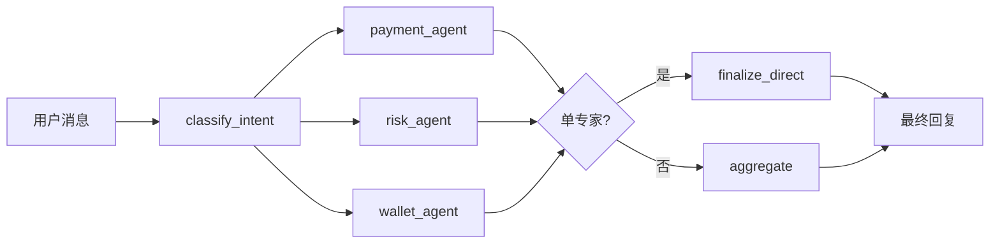

# 上下文 Token 优化说明

本文档总结 Mall Agent 多智能体客服系统中已落地的 **上下文 Token 优化** 方案，便于评审、运维调参和在 LangSmith 中对比效果。

---

## 1. 背景：Token 主要消耗在哪里

一轮用户消息在后端会触发 **多次** Chat Completions 调用，典型链路如下：



优化前的主要问题：

| 问题 | 影响 |
|------|------|
| 固定串行跑满 payment → risk → wallet | 未路由到的专家也走节点（虽可 no-op，仍增加编排开销） |
| 支付/钱包在 tool 循环后再多一次「终稿」LLM | 每专家多 **1 次** 完整调用 |
| RAG 返回 `top_k=6` 且整段 JSON 进 ToolMessage | 单次 tool 上下文很长 |
| `aggregate` 使用 `json.dumps(agent_outputs)` | 重复塞入 assessment、tool 原始结构 |
| Redis 会话 `messages` 无限追加 | 多轮后 state 膨胀（子 Agent 虽 mostly 只用最后一句用户话） |
| 汇总前无任何 SSE 输出 | 用户感知为长时间无响应（与 Token 无关，但常同时优化） |

---

## 2. 优化策略总览

| # | 策略 | 收益类型 | 状态 |
|---|------|----------|------|
| 1 | RAG 结果瘦身（条数、字段、截断） | 降低 tool / 专家输入 | ✅ 已落地 |
| 2 | aggregate 只传专家 `summary` | 降低汇总输入 | ✅ 已落地 |
| 3 | 单专家跳过 aggregate（`finalize_direct`） | 减少 **1 次** LLM | ✅ 已落地 |
| 4 | 条件路由，只执行 `sub_tasks` 中的专家 | 减少无效节点与调用 | ✅ 已落地 |
| 5 | 支付/钱包：无 tool 时复用最后一轮 AI 回复 | 减少 **0～1 次** LLM / 专家 | ✅ 已落地 |
| 6 | 风控：assessment 字段裁剪 + 输出 `summary` | 降低 risk 与 aggregate 输入 | ✅ 已落地 |
| 7 | Redis 会话只保留最近 N 条消息 | 降低多轮 state 体积 | ✅ 已落地 |
| 8 | 缩短各节点 System Prompt | 降低固定开销 | ✅ 已落地 |
| 9 | 分类器提示「尽量只选必要专家」 | 减少 mixed 时全选 | ✅ 已落地 |

**未纳入本次实现（可后续迭代）**

- 历史对话 LLM 摘要写入 `user_context.session_summary`
- Embedding 查询缓存（Redis）
- 路由/结构化与终稿使用不同模型档位

---

## 3. 分项说明

### 3.1 RAG 混合检索瘦身

**文件：** `backend/app/tools/rag_tool.py`、`backend/app/core/context.py`

| 项 | 优化前 | 优化后 |
|----|--------|--------|
| 默认 `top_k` | 6 | **4**（且受 `RAG_TOP_K` 上限约束） |
| 返回字段 | `id`、`text`、`rrf`、`metadata` 等 | 仅 **`text` + `source`** |
| 单条长度 | 全文 | 截断至 **`RAG_CHUNK_MAX_CHARS`**（默认 480 字） |

工具返回示例结构：

```json
{
  "hits": [
    { "text": "退款将在 3-7 个工作日…", "source": "payment_faq" }
  ]
}
```

---

### 3.2 单专家跳过 aggregate（`finalize_direct`）

**文件：** `backend/app/graph/supervisor.py`、`backend/app/core/context.py`

**条件：** `sub_tasks` 长度为 1，且该专家 `agent_outputs` 中已有可展示的 `summary`（或 risk 的 `user_reply`）。

**行为：**

- 不再调用 aggregate 的 LLM；
- 通过 LangGraph `get_stream_writer()` 将最终文本以 `token` 事件流式推到 SSE；
- 图节点：`finalize_direct` → `END`。

**典型场景：** 用户只问退款进度 → 仅 `payment` → 省 **1 次** 汇总模型调用。

---

### 3.3 多专家时的 aggregate 压缩

**文件：** `backend/app/graph/supervisor.py`、`backend/app/core/context.py`

**优化前：** `HumanMessage(content=json.dumps({"agent_outputs": outputs}))`，包含完整 assessment、verdict 嵌套等。

**优化后：** `compact_agent_outputs_for_aggregate()` 生成扁平字典，例如：

```json
{
  "payment": "退款一般 3-7 个工作日到账…",
  "risk": "您的交易已通过审核…"
}
```

每条摘要不超过 **`AGGREGATE_SUMMARY_MAX_CHARS`**（默认 800）。

---

### 3.4 条件路由（只跑需要的专家）

**文件：** `backend/app/graph/supervisor.py`

**优化前：** `dispatch` 后固定 `payment → risk → wallet → aggregate`。

**优化后：**

- `dispatch` 后进入 **第一个** 需要的专家；
- `payment` 结束后：若还需 `risk` / `wallet` 则跳转，否则 `finalize_direct` 或 `aggregate`；
- `risk`、`wallet` 同理。

未列入 `sub_tasks` 的专家 **不会执行** 对应节点。

---

### 3.5 支付 / 钱包 Agent：减少冗余终稿调用

**文件：** `backend/app/agents/payment_agent.py`、`backend/app/agents/wallet_agent.py`

**逻辑：**

1. ReAct 式 tool 循环（最多 3 轮）；
2. 若最后一轮 `AIMessage` **已有正文且无 tool_calls** → 直接作为 `summary`；
3. 否则才追加一次短 system + `ainvoke` 生成终稿（`payment_agent_final` / `wallet_agent_final`）。

另：用户输入可附带 **最近 1 轮** 对话片段（`recent_dialogue_snippet`），便于澄清，而不传入完整 `messages` 列表。

---

### 3.6 风控 Agent：裁剪 assessment

**文件：** `backend/app/agents/risk_agent.py`

**送入 LLM 的 assessment 仅保留：**

- `risk_score`
- `kyc_status`
- `identity_match`
- `velocity_flag`
- `device_trust`

**写入 `agent_outputs` 的结构（供汇总/直出）：**

```json
{
  "summary": "面向用户的完整中文说明…",
  "verdict": { "decision": "approve", "confidence": 0.91 }
}
```

不再把完整 mock assessment 交给 aggregate。

---

### 3.7 会话历史截断（Redis）

**文件：** `backend/app/api/chat.py`、`backend/app/core/context.py`

- 读会话、写回 Redis 前均执行 `truncate_session_messages`；
- 默认只保留最近 **`SESSION_MAX_MESSAGES=16`** 条 LangChain 消息（约 8 轮问答，视消息类型而定）。

---

### 3.8 分类与 Prompt 精简

**文件：** `backend/app/graph/supervisor.py`、各 `agents/*.py`

- `classify_intent` 的 system 提示要求 **尽量只选必要专家**，避免无谓 `mixed` 全选；
- 各专家 system 提示改为短句规则，减少固定 token。

---

## 4. 配置项

在仓库根目录或 `backend/.env` 中配置（参见 `.env.example`）：

| 环境变量 | 默认值 | 说明 |
|----------|--------|------|
| `SESSION_MAX_MESSAGES` | `16` | Redis 中保留的最大消息条数 |
| `RAG_TOP_K` | `4` | RAG 最多返回片段数（工具参数不会超过此值） |
| `RAG_CHUNK_MAX_CHARS` | `480` | 单条知识片段最大字符数 |
| `AGGREGATE_SUMMARY_MAX_CHARS` | `800` | 每个专家传入 aggregate 的摘要上限 |

调参建议：

- 成本仍偏高 → 先将 `RAG_TOP_K` 设为 `3`，`SESSION_MAX_MESSAGES` 设为 `12`；
- 回答缺上下文 → 略增 `RAG_CHUNK_MAX_CHARS` 或 `top_k`，勿同时大幅拉高两者。

---

## 5. 代码索引

| 模块 | 路径 |
|------|------|
| 工具函数（截断、压缩、是否跳过汇总） | `backend/app/core/context.py` |
| 配置项 | `backend/app/core/config.py` |
| 图路由与 finalize / aggregate | `backend/app/graph/supervisor.py` |
| SSE 会话截断 | `backend/app/api/chat.py` |
| RAG 工具 | `backend/app/tools/rag_tool.py` |
| 支付专家 | `backend/app/agents/payment_agent.py` |
| 风控专家 | `backend/app/agents/risk_agent.py` |
| 钱包专家 | `backend/app/agents/wallet_agent.py` |

---

## 6. 效果评估（建议在 LangSmith 验证）

1. 开启 `LANGCHAIN_TRACING_V2=true` 后发送同一测试问题；
2. 对比优化前后同一 `run` 的 **prompt_tokens**；
3. 重点关注节点：`classify_intent`、`payment_agent`、`aggregate`、`finalize_direct`。

**粗算预期（视问题与路由而定）：**

| 场景 | 优化前（约） | 优化后（约） |
|------|------------|------------|
| 单支付 FAQ | 4～8 次 LLM，输入累计偏高 | **2～4 次**，无 aggregate |
| 支付 + 风控 | aggregate 输入常 >4k tokens | aggregate 输入 **约 1～2k** |
| 10 轮以上对话 | `messages` 持续增长 | 稳定在 **16 条** 窗口内 |

---

## 7. 与流式/SSE 的关系

Token 优化不改变 SSE 事件类型，但：

- **单专家**走 `finalize_direct` 时，最终答复在图内通过 **custom stream** 推送 `token`；
- **多专家**仍在 `aggregate` 节点流式输出 `token`；
- 图执行过程中继续推送 `thinking` / `tool_call` 事件。

详见主流程：`backend/app/api/chat.py`。

---

## 8. 相关文档

- [ARCHITECTURE.md](./ARCHITECTURE.md) — 系统架构与数据流  
- [CODE_WALKTHROUGH_zh.md](./CODE_WALKTHROUGH_zh.md) — 按文件阅读代码  
- [README.md](../README.md) — 启动与环境变量  

---

*文档版本与代码实现同步；若后续调整图结构或环境变量，请同步更新本节。*
