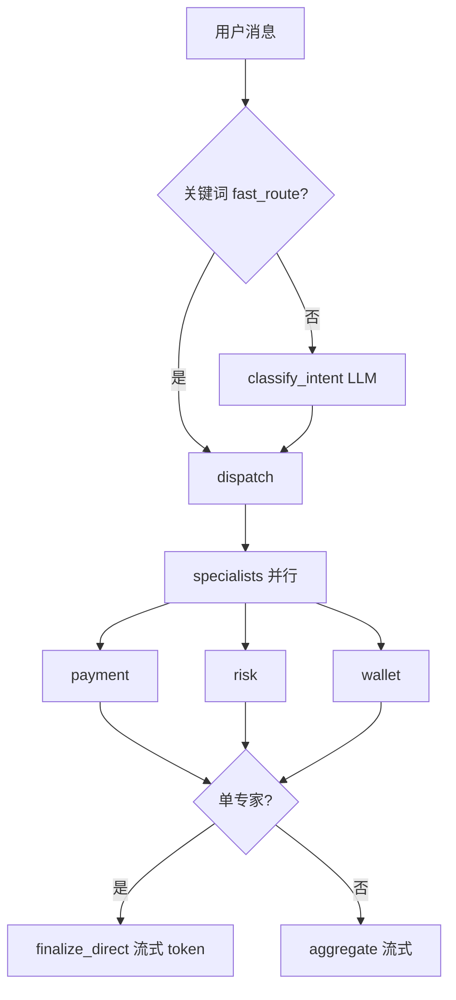

# 回复延迟优化说明

本文档说明 Mall Agent 为缩短 **首字时间（TTFT）** 与 **整轮耗时** 已落地的优化，以及如何调参与观测。

---

## 1. 慢在哪里（优化前）

典型一轮请求的耗时主要来自 **串行 LLM** 与 **重复 RAG I/O**：

| 阶段 | 典型问题 |
|------|----------|
| `classify_intent` | 每条消息一次结构化 LLM，约 0.5–2s |
| payment / risk / wallet | 图里 **串行** 三个节点，多专家时墙钟时间相加 |
| payment tool 循环 | 最多 3 轮「LLM → RAG tool → LLM」，支付类问题常 **3+ 次** LLM |
| hybrid RAG | 每次检索：`embed` + `scroll` 全库建 BM25 + dense search |
| `aggregate` | 多专家时再 **1 次** 汇总 LLM（单专家已可跳过） |

用户侧常表现为：SSE 先出现 `thinking`，但要等很久才有 `token`（首 token 晚）。

---

## 2. 优化思路总览



| 策略 | 作用 | 环境变量 |
|------|------|----------|
| 关键词快路由 | 高置信场景跳过 classify LLM | `ENABLE_FAST_ROUTE=true` |
| 专家并行 | payment/risk/wallet 用 `asyncio.gather` | `ENABLE_PARALLEL_SPECIALISTS=true` |
| 支付直出 RAG | 1 次检索 + 1 次 LLM，不走 tool 循环 | `PAYMENT_DIRECT_RAG=true` |
| RAG 缓存 | BM25 语料 + query embedding TTL | `RAG_BM25_CACHE_TTL`, `RAG_EMBED_CACHE_TTL` |
| 检索并行 | embed 与 scroll/BM25 构建同时进行 | （代码内 `asyncio.create_task`） |
| 单专家跳过 aggregate | 与 Token 优化共用 `should_skip_aggregate` | 见 `TOKEN_OPTIMIZATION_zh.md` |
| KB 写入后清缓存 | ingest 后 `invalidate_rag_cache()` | 无需配置 |

---

## 3. 预期效果（量级）

实际取决于中转 API、模型与 Qdrant 规模，以下为 **相对** 预期：

| 场景 | 优化前（约） | 优化后（约） |
|------|------------|------------|
| 单领域「退款多久」 | classify + payment 3 轮 LLM + RAG×N | fast_route + 1×RAG + 1×LLM + finalize |
| payment + risk 混合 | 串行 2 专家 + aggregate | 并行 max(专家) + aggregate |
| 同会话重复相似问法 | 每次 scroll + embed | 缓存命中，RAG 段明显变短 |

在 LangSmith 中对比同一问题的 span 数量：`classify` 是否消失、`payment_agent` 是否变为 `direct_rag`、并行是否只有一个 `specialists_parallel` 墙钟。

---

## 4. 配置说明

在 `backend/.env` 或仓库根 `.env` 中：

```env
ENABLE_FAST_ROUTE=true
ENABLE_PARALLEL_SPECIALISTS=true
PAYMENT_DIRECT_RAG=true
RAG_BM25_CACHE_TTL=120
RAG_EMBED_CACHE_TTL=300
RAG_DENSE_CANDIDATES=12
PAYMENT_MAX_TOOL_ROUNDS=2
```

| 变量 | 默认 | 说明 |
|------|------|------|
| `ENABLE_FAST_ROUTE` | true | false 时一律走 LLM 分类 |
| `ENABLE_PARALLEL_SPECIALISTS` | true | false 时专家仍串行执行（兼容调试） |
| `PAYMENT_DIRECT_RAG` | true | false 时支付恢复短 tool 循环 |
| `RAG_BM25_CACHE_TTL` | 120 | 秒；KB 更新后 ingest 会主动 invalidate |
| `RAG_EMBED_CACHE_TTL` | 300 | 秒；相同 query 复用向量 |
| `RAG_DENSE_CANDIDATES` | 12 | 向量候选数（越小越快，召回略降） |
| `PAYMENT_MAX_TOOL_ROUNDS` | 2 | 仅 `PAYMENT_DIRECT_RAG=false` 时生效 |

知识库变更后请执行 ingest（见 [KB_INGESTION_zh.md](./KB_INGESTION_zh.md)），会自动刷新 RAG 缓存。

---

## 5. 代码入口

| 模块 | 职责 |
|------|------|
| `app/core/fast_route.py` | `try_fast_route()` 关键词路由 |
| `app/graph/specialists.py` | `run_specialists_parallel()` |
| `app/graph/supervisor.py` | 图：`classify → dispatch → specialists → finalize/aggregate` |
| `app/services/rag_cache.py` | BM25 / embedding 进程内缓存 |
| `app/tools/rag_tool.py` | `hybrid_search` 并行 embed + corpus |
| `app/agents/payment_agent.py` | `_payment_direct_rag` 快路径 |

---

## 6. 观测与排错

1. **SSE**：应先收到 `thinking`，单专家场景尽快出现 `token`（`finalize_direct` 分块写出）。
2. **LangSmith**：查看 trace 中 LLM 调用次数是否从 4–6 次降到 2–3 次（单支付 FAQ）。
3. **仍慢时**：
   - 检查 `OPENAI_API_BASE` 中转延迟与 `OPENAI_MAX_RETRIES`（重试会拉长等待）；
   - Qdrant 是否在远端；`scroll_all_texts` 语料过大时可改为 Qdrant sparse / 分片索引（TODO）；
   - 关闭 LangSmith 采样或仅在调试时开启 tracing。

---

## 7. 后续可做（未实现）

- Qdrant 原生 sparse + 两阶段检索，避免全量 scroll 建 BM25
- 对 classify 使用更小/更快模型
- Redis 缓存热门 query 的 RAG 融合结果
- 前端乐观 UI / 打字机与后端 chunk 对齐

相关文档：[TOKEN_OPTIMIZATION_zh.md](./TOKEN_OPTIMIZATION_zh.md)、[KB_INGESTION_zh.md](./KB_INGESTION_zh.md)。
